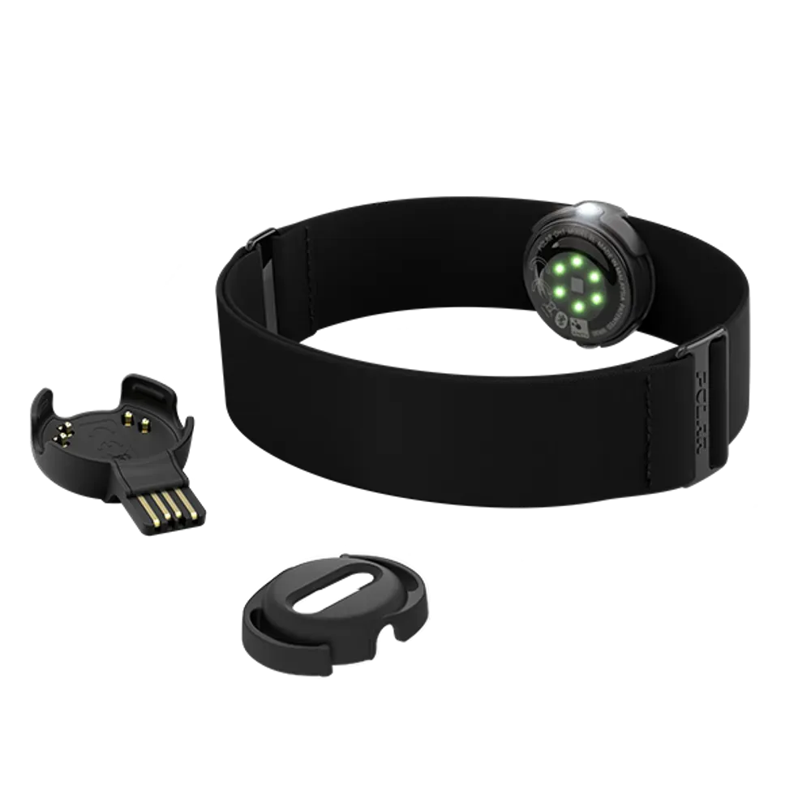

## Polar OH1+


The Polar OH1+ is an optical heart rate monitor that combines versatility, comfort and simplicity. It can be worn on the forearm or upper arm. It is mostly used for fitness objectives to read HR.


* Official website: [https://www.polar.com/us-en/sensors/oh1-optical-heart-rate-sensor](https://www.polar.com/us-en/sensors/oh1-optical-heart-rate-sensor)

## Requirments
1) Install Python Libraries: '''$ pip install pexpect bleak'''


## Node Informations
1) Node name: polar_oh1_node
2) Parameter:
* Device_Mac_Address : a string data type to connect own device via ble/; for example, _'C9:61:FF:AC:8E:23'_

## Topic Information
### For raw data
1) _biosensors/polar_h10/hr_ : 
  * type: standard_msg/Float32
  * size: 1-by-1 
  * detail: the Heart Rate (HR) signal. 


## Test the Node using Launch file

```bash
$ros2 launch polar_h10 ros2-polar_h10.launch.py
```

# Example of Published Topic Data
<p align="center">

</p>
